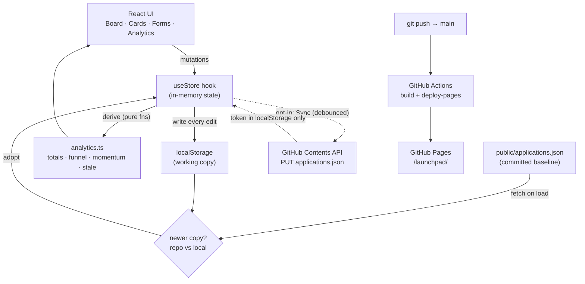

# 🎯 Launchpad — Job Application Tracker

A single-page kanban tracker for a job search: log every role, drag it through a hiring pipeline, tag which tailored résumé you used, and see which résumé actually earns responses.

**Live:** https://shiva-shivanibokka.github.io/launchpad/

---

## Recruiter TL;DR
- **What it does:** A browser-based kanban board that tracks job applications through an 8-stage pipeline (Wishlist → Applied → Screen → Interviewing → Offer → Accepted, plus Rejected/Ghosted), with per-résumé response-rate analytics, follow-up nudges, and a weekly application-pace chart.
- **Hardest problem solved:** Persisting user-owned data with no backend — a localStorage-first store that optionally commits a single JSON document to GitHub via the Contents API, reconciling the browser copy against the repo copy on load so the data follows you across devices without a server or database.
- *(No usage/impact metrics — this is a personal tool, not a product with users; see [Impact](#impact).)*

---

## Overview / Motivation
Spreadsheets are where job searches go to die: no pipeline view, no reminder when something goes quiet, and no way to answer *"which version of my résumé is actually working?"* Launchpad is a personal tool built to make an active AI/ML job search legible — turn a flat list into a kanban pipeline, surface applications that need a follow-up before they rot, and measure response rate **per résumé variant** so effort goes where it converts.

It's the fourth in a family of self-tracking dashboards (alongside prep and build-log trackers), and deliberately built with **no backend** — data is the user's, lives in their browser, and syncs to their own GitHub repo only if they choose to add a token.

## Features
- **8-stage kanban pipeline** with drag-and-drop between columns; every status change is timestamped into the card's history (this history is what powers the analytics).
- **Quick-move arrows** (◀ ▶) to advance/retreat a card a stage without dragging — works where drag doesn't (trackpad, touch).
- **Per-résumé analytics** — a funnel per résumé version (applied → responded → interviewed → offers) with response rate, best performer flagged. This is the payoff of tagging each application with the résumé used.
- **Follow-up surface** — auto-lists applications with a due follow-up date, or that have sat in "Applied" 14+ days with no response.
- **Stale detection** — active cards untouched for 10+ days get a subtle glow so nothing silently rots.
- **Momentum chart** — a 12-week bar chart of applications sent per week.
- **Résumé manager** — named résumé versions, each with an optional link to the actual file; a card's résumé pill becomes a clickable link when a URL is set.
- **Collapsible columns**, **sort** (newest / oldest / follow-up due), and **filters** (search, résumé, location type).
- **Optional cross-device sync** — commit the data to `applications.json` via a GitHub token, entirely opt-in; works fully offline without one.
- **Reduced-motion aware** animated background (dense fireflies over a dark purple/emerald gradient).

## Architecture
Launchpad is a **client-only SPA** — there is no server, database, or API of its own. The single source of truth is one JSON document (`{ resumes, applications }`); everything else derives from it.



**Why this shape:**
- **No backend by design.** The data is personal and low-volume; a server/DB would be pure overhead and a privacy surface. localStorage is the working store; the optional GitHub commit is the only "sync."
- **Reconciliation over merge.** On load, the app compares the repo copy's `generatedAt` against the browser's last-edit time and adopts whichever is newer — so syncing on one device propagates to another without conflict-resolution machinery, which a single-user tool doesn't need.
- **Token never leaves the browser.** The optional PAT lives only in `localStorage` and is used client-side to call the GitHub Contents API; it is never committed. The app is fully functional without it.
- **Derived state is pure.** All metrics (response rate, per-résumé funnel, momentum, staleness) are pure functions of the application list, so the UI stays presentational and the numbers can't drift out of sync with the data.

## Tech Stack
| Layer | Choice | Version | Why |
|---|---|---|---|
| Language | TypeScript (strict) | 5.6 | Type-safe data model for the application/résumé documents |
| UI | React | 18.3 | Component model for the board/cards/forms |
| Build | Vite | 5.4 | Fast dev server + small production bundle |
| Styling | Tailwind CSS | 3.4 | Utility-first styling, dark theme via config |
| Persistence | localStorage + GitHub Contents API | — | No backend; user owns their data |
| CI/CD | GitHub Actions → GitHub Pages | — | Push-to-deploy static hosting |

No runtime dependencies beyond React — the background animation, drag-and-drop, and charts are hand-rolled with the Canvas API, native HTML5 drag events, and CSS/flex, with zero UI libraries.

## Skills Demonstrated
- **Frontend engineering** — React + TypeScript (strict) SPA, component decomposition, presentational/derived-state separation.
- **System design & architecture** — documented tradeoffs (backend-less persistence, load-time reconciliation strategy, opt-in sync).
- **Client-side API integration** — GitHub Contents API for read/commit, with token handling kept off the server.
- **CI/CD pipeline implementation** — GitHub Actions build + deploy with concurrency control and retry-on-transient-failure.
- **Cloud deployment** — static hosting on GitHub Pages under a project sub-path.
- **Data visualization** — hand-built funnel + weekly momentum chart; Canvas-based animated background respecting `prefers-reduced-motion`.

## Getting Started
```bash
git clone https://github.com/shiva-shivanibokka/launchpad.git
cd launchpad
npm install
npm run dev          # http://localhost:5173/launchpad/
```

Build and preview the production bundle:
```bash
npm run build        # tsc -b && vite build → dist/
npm run preview      # serves dist/ at /launchpad/
```

**Optional cross-device sync:** click **⚙** in the app, paste a GitHub fine-grained PAT with **Contents: read & write** on the `launchpad` repo, and Save. Edits then commit to `public/applications.json` (debounced). The token is stored only in your browser. Without a token, all data lives locally — nothing leaves the browser.

## Usage
There's no API to call — it's a UI. The data model (`src/data/types.ts`) is the contract:

```ts
interface Application {
  id: string
  company: string
  role: string
  resumeId: string | null          // → a Resume version
  status: StatusId                  // wishlist | applied | screen | interviewing | offer | accepted | rejected | ghosted
  dateApplied: string | null        // yyyy-mm-dd
  jobUrl?: string
  location?: string
  locationType?: 'Remote' | 'Hybrid' | 'Onsite' | ''
  nextAction?: string
  followUpDate?: string | null
  notes?: string
  history: { status: StatusId; at: string }[]   // powers the analytics
  createdAt: string
}
```

Typical flow: **＋ Add application** → drag its card between columns (or use ◀ ▶) as things progress → tag the résumé you used → let the follow-up strip and stale glow tell you what needs attention → read the per-résumé analytics to see what's converting.

## Project Structure
```
launchpad/
├─ public/
│  └─ applications.json        # committed baseline (résumés + applications); refreshed on sync
├─ src/
│  ├─ data/                    # types.ts, statuses.ts (the pipeline definition)
│  ├─ lib/                     # store.ts (persistence + reconciliation), github.ts (Contents API), analytics.ts (pure derivations)
│  ├─ components/              # Board, AppCard, AppForm, StatTiles, Momentum, ResumeAnalytics, FollowUps, ManageResumes, Header, FireflyBackground, ui
│  ├─ hooks/                   # usePrefersReducedMotion
│  ├─ App.tsx                  # composition + filter/sort state
│  └─ index.css                # dark theme + animated gradient
├─ .github/workflows/deploy.yml # build + deploy to GitHub Pages
└─ vite.config.ts              # base: '/launchpad/'
```

## Testing
No automated test suite yet. The data engine in `src/lib/` (reconciliation logic in `store.ts`, the pure functions in `analytics.ts`) is the part most worth covering, and is written to be unit-testable (pure functions, no DOM) — adding tests there is the top item on the roadmap below. Type-checking runs on every build (`tsc -b`) and in CI.

## Deployment
Deployed via **GitHub Actions → GitHub Pages** (`.github/workflows/deploy.yml`): every push to `main` type-checks, builds, and publishes `dist/` to Pages at `/launchpad/`. The workflow uses `concurrency` to avoid overlapping deploys and retries `deploy-pages` up to 3× to ride out transient Pages backend errors.

## Impact
This is a **personal tool**, so there are no user counts, benchmarks, or performance numbers to report — and none are invented here. Qualitatively, it replaces a spreadsheet with a pipeline view, converts "which résumé is working?" from unanswerable into a single glance at a funnel, and removes the manual effort of remembering which applications have gone quiet.

## Roadmap
- Unit tests for the reconciliation logic and analytics functions.
- JSON export/import as a backup independent of the GitHub sync.
- Optional import from the résumé/JD tooling that produces the tailored résumé variants.
- Per-stage duration analytics (how long applications sit in each stage).

## License
No license file yet — this is a personal project and not currently licensed for reuse. Ask before reusing.
